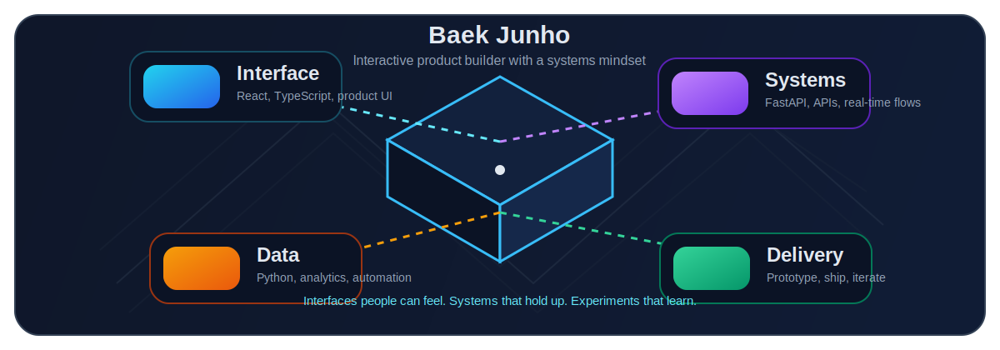
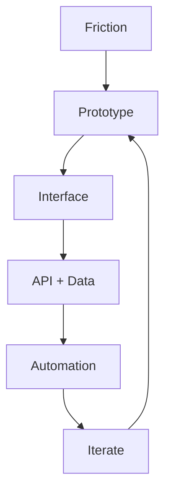

# Baek Junho

<p align="center">
  <strong>Interactive product builder with a systems mindset.</strong><br />
  I build interfaces people can feel, backend flows that hold up, and data-driven experiments that learn.
</p>

<p align="center">
  Seoul, South Korea | Yonsei University
</p>

<p align="center">
  <a href="https://github.com/junho-baek?tab=repositories">Explore repositories</a>
</p>

<p align="center">
  
</p>

## Capability Prism

GitHub's built-in 3D viewer is limited, so the main visual stays static and clean. If you want the interactive version, open the block below and rotate it.

<details>
<summary><strong>Open the interactive capability block</strong></summary>

Drag to rotate the object. It represents interface, systems, data, and delivery.

```stl
solid capability_block
  facet normal 0 0 1
    outer loop
      vertex -1.0 -1.0 1.0
      vertex 1.0 -1.0 1.0
      vertex 1.0 1.0 1.0
    endloop
  endfacet
  facet normal 0 0 1
    outer loop
      vertex -1.0 -1.0 1.0
      vertex 1.0 1.0 1.0
      vertex -1.0 1.0 1.0
    endloop
  endfacet
  facet normal 0 0 -1
    outer loop
      vertex -1.0 -1.0 -1.0
      vertex 1.0 1.0 -1.0
      vertex 1.0 -1.0 -1.0
    endloop
  endfacet
  facet normal 0 0 -1
    outer loop
      vertex -1.0 -1.0 -1.0
      vertex -1.0 1.0 -1.0
      vertex 1.0 1.0 -1.0
    endloop
  endfacet
  facet normal 0 1 0
    outer loop
      vertex -1.0 1.0 -1.0
      vertex -1.0 1.0 1.0
      vertex 1.0 1.0 1.0
    endloop
  endfacet
  facet normal 0 1 0
    outer loop
      vertex -1.0 1.0 -1.0
      vertex 1.0 1.0 1.0
      vertex 1.0 1.0 -1.0
    endloop
  endfacet
  facet normal 0 -1 0
    outer loop
      vertex -1.0 -1.0 -1.0
      vertex 1.0 -1.0 1.0
      vertex -1.0 -1.0 1.0
    endloop
  endfacet
  facet normal 0 -1 0
    outer loop
      vertex -1.0 -1.0 -1.0
      vertex 1.0 -1.0 -1.0
      vertex 1.0 -1.0 1.0
    endloop
  endfacet
  facet normal 1 0 0
    outer loop
      vertex 1.0 -1.0 -1.0
      vertex 1.0 1.0 1.0
      vertex 1.0 -1.0 1.0
    endloop
  endfacet
  facet normal 1 0 0
    outer loop
      vertex 1.0 -1.0 -1.0
      vertex 1.0 1.0 -1.0
      vertex 1.0 1.0 1.0
    endloop
  endfacet
  facet normal -1 0 0
    outer loop
      vertex -1.0 -1.0 -1.0
      vertex -1.0 -1.0 1.0
      vertex -1.0 1.0 1.0
    endloop
  endfacet
  facet normal -1 0 0
    outer loop
      vertex -1.0 -1.0 -1.0
      vertex -1.0 1.0 1.0
      vertex -1.0 1.0 -1.0
    endloop
  endfacet
endsolid capability_block
```

</details>

| Face | Capability |
| --- | --- |
| Interface | React, TypeScript, interaction-focused UI, frontend experiments |
| Systems | FastAPI, APIs, real-time communication, PostgreSQL-backed services |
| Data | Python automation, crawling, analytics, recommendation logic |
| Delivery | Fast prototyping, iteration loops, turning studies into working products |

## Selected Builds

| Project | What it shows |
| --- | --- |
| [AutoHRAnalytics](https://github.com/junho-baek/AutoHRAnalytics) | Workflow automation thinking across Notion API, FastAPI, and React. |
| [InsideOutDJ](https://github.com/junho-baek/Ybigta-25th-project-InsideOutDJ) | A diary-based music recommendation project that mixes product ideas with data logic. |
| [zoom](https://github.com/junho-baek/zoom) | Real-time interaction exploration through a Zoom-clone implementation. |
| [remixstudy](https://github.com/junho-baek/remixstudy) | Full-stack web study with TypeScript, Supabase, and PostgreSQL. |

## How I Build



## Capability Notes

<details>
<summary><strong>Interface</strong></summary>

I care about how a product feels in motion: layout, feedback, rhythm, and the small interactions that make an interface usable.

Relevant repos: [MomentumClone](https://github.com/junho-baek/MomentumClone), [zoom](https://github.com/junho-baek/zoom), [react_study](https://github.com/junho-baek/react_study)

</details>

<details>
<summary><strong>Systems</strong></summary>

I like connecting interface ideas to reliable backend flows with clear data boundaries.

Relevant repos: [24-2BackendStudy](https://github.com/junho-baek/24-2BackendStudy), [AutoHRAnalytics](https://github.com/junho-baek/AutoHRAnalytics), [remixstudy](https://github.com/junho-baek/remixstudy)

</details>

<details>
<summary><strong>Data</strong></summary>

I use Python and SQL to collect signals, automate routines, and test recommendation or analytics ideas.

Relevant repos: [Crawling-cheatsheet](https://github.com/junho-baek/Crawling-cheatsheet), [SQL_DB_Study](https://github.com/junho-baek/SQL_DB_Study), [InsideOutDJ](https://github.com/junho-baek/Ybigta-25th-project-InsideOutDJ)

</details>

<details>
<summary><strong>Delivery</strong></summary>

A lot of my work starts as a clone, study, or experiment and gets pushed toward something usable.

Relevant repos: [MomentumClone](https://github.com/junho-baek/MomentumClone), [zoom](https://github.com/junho-baek/zoom), [AutoHRAnalytics](https://github.com/junho-baek/AutoHRAnalytics)

</details>

## Activity Snapshot

<div align="center">
  <a href="https://github.com/junho-baek/github-readme-stats">
    
  </a>
  <br />
  <a href="https://github.com/junho-baek/github-readme-stats">
    
  </a>
</div>
