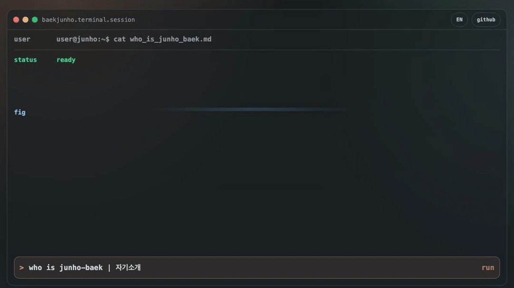

# Baek Junho | AI-Native Product Builder

<p align="center">
  안녕하세요. AI Native 개발 문화를 기반으로 사회 문제 해결형 제품을 기획·개발하는 백준호입니다.<br />
  FE·BE·DE·AI Agent 역량을 결합해, 아이디어를 빠르게 제품으로 만들고 데이터로 개선합니다.
</p>

<p align="center">
  <a href="https://junho-baek.github.io/junho-baek/">Interactive Terminal</a>
  ▌
  <a href="./site/docs/profile.html">Profile Detail</a>
  ▌
  <a href="./site/docs/projects.html">Project Detail</a>
  ▌
  <a href="https://github.com/junho-baek?tab=repositories">Repositories</a>
</p>

<p align="center">
  <a href="https://junho-baek.github.io/junho-baek/">
    
  </a>
</p>

## Who I Am

- AI Native Product Builder이자 n8n Workflow Automation Builder로서, 제품의 실행 속도와 검증 속도를 함께 높이는 일을 지향합니다.
- 사용자 경험(UX), 백엔드/데이터 구조, 운영 자동화를 하나의 루프로 연결해 문제 해결 중심으로 제품을 설계합니다.
- 아이디어 단계에서 멈추지 않고 실제 MVP 배포와 사용자 검증까지 책임지는 방식으로 일합니다.

## Quick Terminal Modes

```bash
> who is junho-baek | 자기소개
> projects | 프로젝트
```

- Live terminal: [junho-baek.github.io/junho-baek](https://junho-baek.github.io/junho-baek/)
- Detailed profile doc: [site/docs/profile.html](./site/docs/profile.html)
- Detailed projects doc: [site/docs/projects.html](./site/docs/projects.html)

## Core Skills

| Domain | Skills |
| --- | --- |
| Product | Notion, Figma, Business Logic Design |
| Frontend | React, Next.js, shadcn/ui, Tailwind CSS |
| Backend/Data | FastAPI, Supabase, PostgreSQL, n8n |
| AI/Automation | LangGraph, LangChain, MCP server design, Codex |
| Infra/DevOps | Docker, AWS |
| Growth/Marketing | GTM, GA4, Meta Pixel, UTM measurement |

## Selected Projects

| Project | Summary | Stack |
| --- | --- | --- |
| Glucofit (산학협력) | 혈당 데이터 기반 개인화 식단 관리 앱 개선 | React, FastAPI, PostgreSQL, Pandas, AWS |
| AIDP (SKT Fellowship) | 사내 데이터 흐름 파악을 위한 AI Agent | LangGraph, LangChain, Redis, Docker |
| 든든AI | 중장년층 숏폼 제작·수익화 Agent SaaS | React, FastAPI, n8n, Supabase, PostgreSQL |
| Parrot Kit | 크리에이터 워크플로우·수익화 AI Native Toolkit | Codex, Supabase, Next.js, shadcn/ui, GTM, GA4, Meta Pixel, LemonSqueezy |

- Parrot Kit repository: [Parrotkit-deploy (dev)](https://github.com/junho-baek/Parrotkit-deploy/tree/dev)
- Project deep dive: [site/docs/projects.html](./site/docs/projects.html)

## Activity & Awards

- 연세대 Y-Start-up Demo Day 우수상 (2026.02)  
  든든AI의 시장성, 문제 해결 적합성, MVP 완성도, 실고객 검증 성과를 인정받았습니다.
- YBIGTA Data Engineering Team Leader (2024.07 - 2025.12)
- SKT AI Fellowship 7기 (2025.06 - 2025.11)
- 연세 GenAI 활용 대회 금상 (2025.11)
- 서강대 x Upstage AI Workflow Hackathon 최우수상 (2025.11)
- 연세대 x Upstage LLM Query Hackathon 대상 (2025.11)

## Contact

- Email: [junho6610@yonsei.ac.kr](mailto:junho6610@yonsei.ac.kr)
- GitHub: [github.com/junho-baek](https://github.com/junho-baek)
