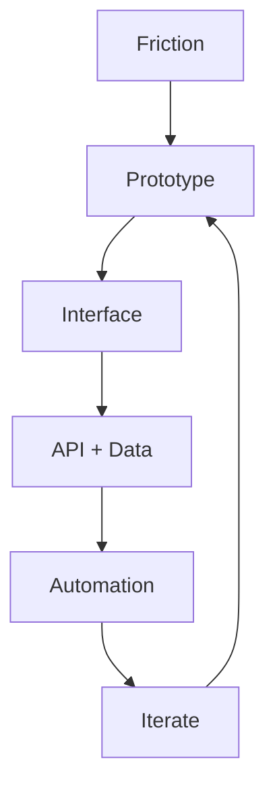

# Baek Junho

  <strong>Interactive product builder with a systems mindset.</strong> 
  I build interfaces people can feel, backend flows that hold up, and data-driven experiments that learn.

  Seoul, South Korea | Yonsei University

  <a href="https://github.com/junho-baek?tab=repositories">Explore repositories</a>
  ·
  <a href="https://junho-baek.github.io/junho-baek/">Open interactive terminal</a>

  

  Click the terminal preview to open the live interactive version.

## Launch Build Console

<strong>Open console</strong> · pick a mode

<strong>Interface Mode</strong> · React, TypeScript, motion-driven UI

Build surfaces that feel responsive and readable.

Repos: [MomentumClone](https://github.com/junho-baek/MomentumClone), [zoom](https://github.com/junho-baek/zoom), [react_study](https://github.com/junho-baek/react_study)

<strong>Systems Mode</strong> · FastAPI, APIs, real-time flows

Connect product ideas to backend flows that can keep up.

Repos: [24-2BackendStudy](https://github.com/junho-baek/24-2BackendStudy), [AutoHRAnalytics](https://github.com/junho-baek/AutoHRAnalytics), [remixstudy](https://github.com/junho-baek/remixstudy)

<strong>Data Mode</strong> · Python, crawling, analytics

Collect signals, automate work, and test data-driven product ideas.

Repos: [Crawling-cheatsheet](https://github.com/junho-baek/Crawling-cheatsheet), [SQL_DB_Study](https://github.com/junho-baek/SQL_DB_Study), [InsideOutDJ](https://github.com/junho-baek/Ybigta-25th-project-InsideOutDJ)

<strong>Delivery Mode</strong> · prototype, ship, iterate

Turn studies and experiments into working builds quickly.

Repos: [AutoHRAnalytics](https://github.com/junho-baek/AutoHRAnalytics), [zoom](https://github.com/junho-baek/zoom), [remixstudy](https://github.com/junho-baek/remixstudy)

## Selected Builds

| Project | What it shows |
| --- | --- |
| [AutoHRAnalytics](https://github.com/junho-baek/AutoHRAnalytics) | Workflow automation thinking across Notion API, FastAPI, and React. |
| [InsideOutDJ](https://github.com/junho-baek/Ybigta-25th-project-InsideOutDJ) | A diary-based music recommendation project that mixes product ideas with data logic. |
| [zoom](https://github.com/junho-baek/zoom) | Real-time interaction exploration through a Zoom-clone implementation. |
| [remixstudy](https://github.com/junho-baek/remixstudy) | Full-stack web study with TypeScript, Supabase, and PostgreSQL. |

## How I Build

## Activity Snapshot

  
   
  

