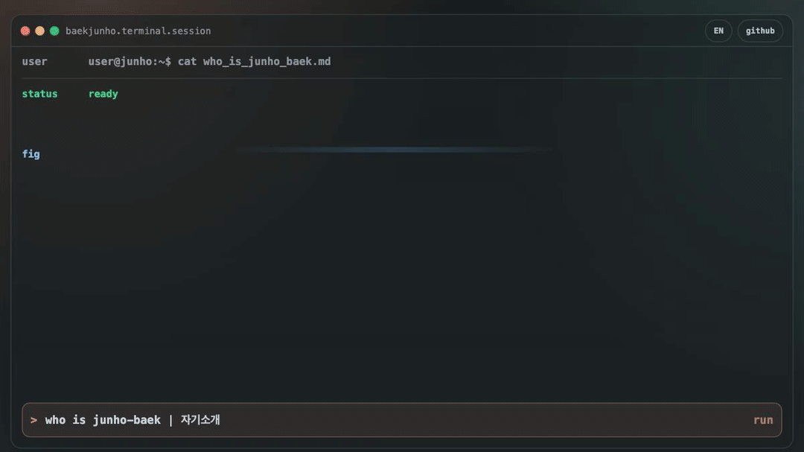

# Baek Junho | AI-Native Product Builder

<p align="center">
  <strong>AI에게 빠르게 위임하되, 결과의 책임은 구조·정책·검증으로 회수합니다.</strong><br />
  모호한 비즈니스 문제를 실행 가능한 Agent Workflow와 제품으로 바꾸는 백준호입니다.
</p>

<p align="center">
  <a href="https://junho-baek.github.io/junho-baek/">Interactive Profile</a>
  ·
  <a href="./site/docs/projects.html">Project Notes</a>
  ·
  <a href="https://github.com/junho-baek?tab=repositories">Repositories</a>
  ·
  <a href="mailto:junho6610@yonsei.ac.kr">Email</a>
</p>

<p align="center">
  <a href="https://junho-baek.github.io/junho-baek/">
    
  </a>
</p>

## About

- Frontend·Backend·Data·AI Agent를 연결해 아이디어를 **검증 가능한 제품 흐름**으로 만듭니다.
- Commerce, Wellness, Content Operations처럼 사용자·상품·데이터가 얽힌 문제를 좋아합니다.
- LLM은 탐색·해석·초안 생성에 활용하고, 안전·권한·스키마·발행은 결정론적 정책과 사람의 승인으로 통제합니다.
- 구현 속도뿐 아니라 왜 이 구조를 택했는지, 어디서 깨지는지, 무엇으로 검증했는지까지 설명할 수 있어야 한다고 생각합니다.

## What I Build

| Area | Focus |
| --- | --- |
| Agent Systems | OpenAI/Cloudflare Agents SDK, LangGraph, MCP, skill-driven orchestration, producer–judge workflows |
| Product Engineering | TypeScript, React Router/Next.js, Python, FastAPI, API·Admin·Customer 경계 설계 |
| Data & Automation | PostgreSQL, Supabase, Redis, pgvector, n8n, queue-based workflows |
| Quality & Delivery | Deterministic policy gates, type safety, unit/E2E tests, Docker, AWS, Cloudflare |

## Featured Work

| Project | Problem & Ownership | Evidence |
| --- | --- | --- |
| [Junho Probe Plate](https://github.com/junho-baek/junho-probe-plate) | AI 협업을 기술·의도·인지의 독립 증거로 관리하는 개인 하네스. 병렬 Producer·Refactor·Verify·Review·Quiz 운영과 Query Wiki 설계 | Public repository · reusable skills and review workflow |
| OLIVE BETTER | MD의 트렌드 조사→상품 선별→카피·화면 생성→검토·발행→반응 재적용을 연결한 웰니스 기획전 자동화 MVP. AI 제안과 TypeScript 정책 gate를 분리 | COFATHON Olive Young Track TOP 3 · final 2nd |
| Data Lineage Impact Analysis Agent | 데이터 변경의 영향 범위를 대화로 탐색. Agent의 도구 선택과 순서가 중요한 Lineage 조회 Workflow를 분리하고 MCP로 제공 | SKT AI Fellowship 7기 · GPT-4o-mini ReAct 대비 answer 0.362→0.964, path 0.536→0.967 |
| 든든AI | 중장년 사용자의 숏폼 기획·생성·편집 파편화를 End-to-End SaaS로 연결. 제품, 생성 파이프라인, 사용자 검증과 단위경제 설계 | 50명 조사 · 초기 가입자 49명 · 첫 영상 발행 82% · 금상/우수상 |
| K-PACK | 화장품 패키지 사진 한 장을 5개국 현지화 문구·규제 검토·3D 시안·숏폼 키비주얼로 전환하는 Agent 서비스 | Wanted AI Championship 2026 submission · rule/model fallback and cost guardrails |
| [ParrotKit](https://github.com/junho-baek/parrotkit_app) | SKU의 USP를 크리에이터 언어와 장면으로 변환하고 캠페인 운영·성과 흐름까지 연결하는 AI-native UGC/commerce toolkit | Public product repository · beauty commerce B2B discovery and prototype |

More detail: [Project Notes](./site/docs/projects.html)

## Open-Source Labs

| Repository | What it explores |
| --- | --- |
| [OwnCanvas](https://github.com/junho-baek/owncanvas) | 사용자가 이미 보유한 키·모델을 연결하는 local-first creative AI canvas |
| [AgentCart](https://github.com/junho-baek/agentcart_priv) | 큐레이터의 취향·상품 맥락·고지 정보를 shopping agent가 읽는 commerce context layer |
| [BYOKIYB](https://github.com/junho-baek/byokiyb) | 비밀값을 채팅에 노출하지 않고 모바일에서 로컬 프로젝트로 전달하는 one-time credential intake |
| [oh-my-node-flow](https://github.com/junho-baek/oh-my-node-flow) | Agent·automation workflow를 위한 visual node-flow experiments |
| [AI Fellowship Demo](https://github.com/junho-baek/AI-Fellowship-Demo) | 데이터 Lineage와 Impact Analysis Agent의 초기 공개 실험 |

## How I Work

```text
Problem & constraints
        ↓
Intent and acceptance criteria
        ↓
AI-assisted implementation
        ↓
Deterministic gates + human decision
        ↓
Tests, evidence, and closed-book explanation
```

- **Technique** — 실제로 실행되고 유지 가능한가: 경계, 타입, 보안, 빌드, 테스트로 확인합니다.
- **Intent** — 무엇을 왜 맡겼는가: 목표·제약·대안·실패·재검증을 기록합니다.
- **Cognition** — 산출물을 이해하는가: 정상·비정상 경로와 파손 조건을 자기 말로 설명합니다.

## Awards & Activities

- **2026 COFATHON Olive Young Track TOP 3** — final 2nd (KRAFTON · CJ Olive Young, 2026.07)
- **Y-Startup³ Entrepreneurship Competition, Excellence Award** — 든든AI 사업성·수익구조 검증 (2026.02)
- **Yonsei GenAI Competition, Gold Prize** — 든든AI End-to-End product (2025.12)
- **LLM Query Hackathon, Grand Prize** — 13-rule Korean proofreading prompt and candidate review flow (2025.11)
- **AI Workflow Hackathon, Top Excellence Award** — n8n content generation·evaluation·publishing workflow, team lead (2025.11)
- **SKT AI Fellowship 7기** — Agent Architecture and MCP-based Lineage exploration (2025.06–11)
- **YBIGTA Data Engineering** — Glucofit industry project, DE team operation, AGI Agent Hackathon planning (2024.09–2025.06)

## Contact

- Email: [junho6610@yonsei.ac.kr](mailto:junho6610@yonsei.ac.kr)
- GitHub: [github.com/junho-baek](https://github.com/junho-baek)
- Based in Seoul, South Korea
